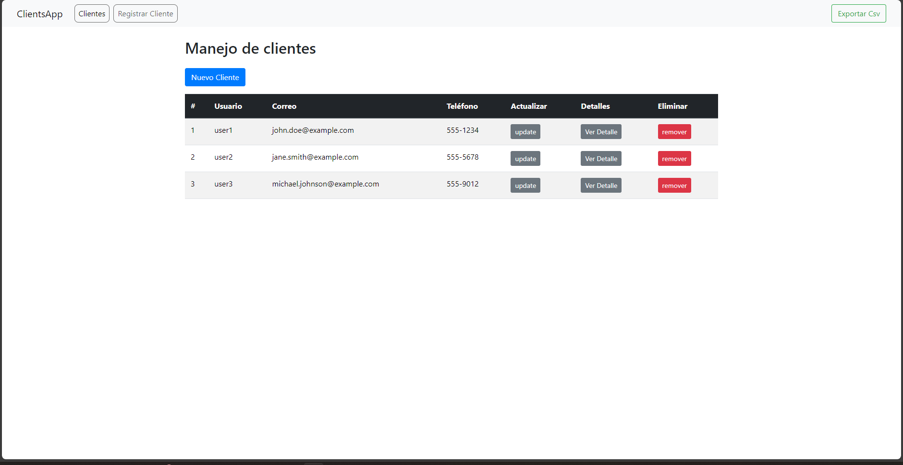

# Sistema de Manejo de Clientes

## _Interfaz Web para Gestión de Clientes y Direcciones_

Este proyecto es una interfaz web diseñada para la gestión de clientes y sus direcciones, comunicándose con un servicio REST API externo desarrollado en Java con Spring Framework, se implementó un crud que a través del backend interactúa con una base de datos en MySQL para almacenar y gestionar la información de clientes y sus respectivas direcciones.

### Características Principales:

- **Interfaz Web ReactJS:** Desarrollada utilizando la biblioteca de JavaScript ReactJS, esta interfaz ofrece una experiencia de usuario fluida y receptiva.
- **React Router Dom:** Para la navegación entre distintas vistas de la aplicación.
- **Swal:** Integra SweetAlert para proporcionar mensajes de alerta y confirmación de manera atractiva.
- **Hooks:** Utiliza hooks de React, como useState, useReducer, useEffect, y custom hooks para gestionar el estado de los componentes y realizar acciones específicas.
- **Reutilización de Componentes:** Se implementa la reutilización de componentes para maximizar la eficiencia del desarrollo y el mantenimiento del código.
- **Centralización de Dependencias:** Con el contexto de React se adopta una estrategia de centralización de dependencias para garantizar la coherencia y la fácil actualización de las bibliotecas utilizadas.
- **Exportación de Archivos:** Capacidad de exportar datos de clientes y direcciones en formato CSV o texto para su posterior análisis o procesamiento.

### Características del Backend:

- **Java 20 y Spring 3.2.2:** Utiliza las versiones 20 de Java y 3.2.2 de Spring Framework para el desarrollo del backend, aprovechando las últimas características y mejoras de estos lenguajes y frameworks.
- **Lombok:** Se utiliza la biblioteca Lombok para reducir la verbosidad del código eliminando la necesidad de escribir getters, setters, constructores y otros métodos repetitivos. 
- **ORM JPA (Java Persistence API):** Implementa JPA para proporcionar un mecanismo de mapeo objeto-relacional que permite a la aplicación interactuar con la base de datos.
  - **JPA facilita las siguientes funcionalidades:** 
	 - Mapeo de entidades de Java a tablas de base de datos. 
     - Realización de operaciones CRUD (Crear, Leer, Actualizar, Eliminar) en la base de datos utilizando métodos de Java.
     - Definición de relaciones entre entidades (uno a uno, uno a muchos, muchos a muchos) mediante anotaciones.
- **Patrón MVC (Modelo-Vista-Controlador):** Implementa el patrón de diseño MVC, donde: 
  - **Modelo :** Representa los datos y la lógica de la aplicación, incluyendo las clases de entidad JPA que representan los objetos almacenados en la base de datos. 
  - **Vista (View):** Define la presentación de los datos al usuario, como los endpoints REST API que exponen los recursos y las respuestas HTTP que se devuelve
  - **Controlador (Controller):** Actúa como intermediario entre el modelo y la vista, gestionando las solicitudes del usuario, realizando operaciones en el modelo y seleccionando la vista adecuada para mostrar los resultados

### Gestión de la Base de Datos:

El backend proporciona funcionalidades avanzadas para la gestión de la base de datos, incluyendo:

- **Generación Automática de la Base de Datos:** Utilizando anotaciones en las entidades, el backend puede generar automáticamente la estructura de la base de datos.
- **Actualización Incremental de la Base de Datos:** Permite actualizar la base de datos de manera incremental, aplicando solo los cambios necesarios.
- **Campos de Auditoría:** Admite la inclusión de campos de auditoría en las entidades para rastrear cambios y mantener la integridad de los datos.

## Instalación y Uso

Para utilizar esta aplicación, sigue estos pasos:

1. Clonar el repositorio desde GitHub.
2. Instalar las dependencias necesarias utilizando npm.
3. Iniciar la aplicación mediante el comando `npm start` . 
